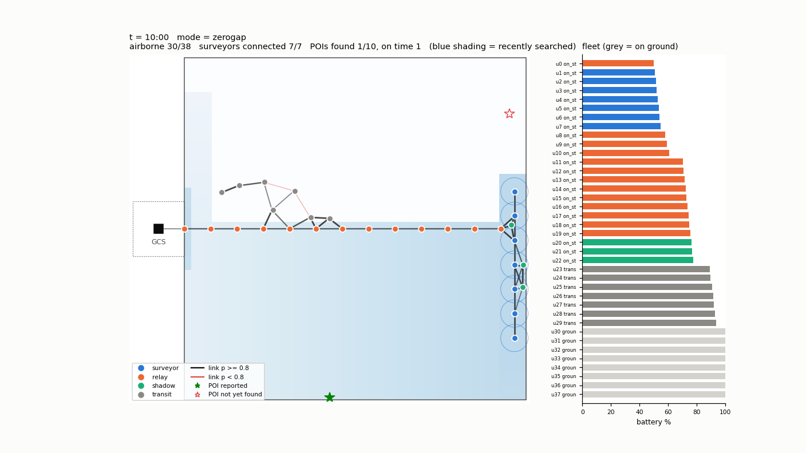

# ZERO-GAP Swarm

Team: Dhvaja
Team ID: TM-D76C0CEA600
Authors: Saianshi Mohapatra (lead), Esha Agrawal, Raj Srivastava

Demo video: [<VIDEO_LINK>](https://youtu.be/C9hjvqqHyYo)

This is our Stage 1 simulation entry for IIT Bombay Techfest PUSHPAK Grand Challenge 1,
"UAV-X: Resilient BVLOS Swarm Challenge". A swarm of UAVs searches a 1 km x 1 km area for
10 POIs that appear at random places and times. Every POI report has to reach the ground
station within 10 s. Radio links reach only 100 m, batteries last 20 min and the mission
lasts 45 min.

We keep the swarm connected with a relay backbone shaped like a comb, plus two ideas of our own.

Relay Baton (make-before-break). Every UAV keeps track of
`time_to_must_return = battery - time_home - 60 s`. We send a charged relief early, so it
is already waiting next to the slot before this time runs out. The old UAV only leaves after
the live comm graph shows that everyone stays connected without it. Reliefs can meet moving
slots because all UAVs share the same fixed sweep schedule. A UAV flying home with battery
left can be sent to another slot instead of landing.

Articulation-Point Shield. Every tick we run Tarjan's algorithm on the live graph to find
the UAVs whose loss would split the network. The ones that would cut off the most surveyors
get a spare "shadow" relay next to them, which gives a second path.



Simulator video (45-min mission in 22 s): [`results/demo_zerogap.mp4`](results/demo_zerogap.mp4).
More frames: `docs/figures/snapshot_t1420.png` (relief in progress) and `docs/figures/snapshot_t2150.png`.

## Results

20 seeds per condition, N = 38 UAVs. All numbers come from real runs of the simulator.

| metric (mean over seeds) | baseline | ZERO-GAP | baseline + faults | ZERO-GAP + faults |
|---|---|---|---|---|
| POIs reported on time (<= 10 s) | 65.5 % | 90.5 % | 62.0 % | 87.0 % |
| POIs found (of 10) | 8.85 | 9.05 | 8.85 | 8.85 |
| worst report delay per run | 259 s | 0.5 s | 256 s | 7.2 s |
| surveyor connectivity availability | 50.7 % | 94.8 % | 48.3 % | 90.4 % |
| zero-gap handovers | 0 % | 78.8 % | 0 % | 75.0 % |
| mean handover gap | 194 s | 16 s | 193 s | 24 s |
| recovery time after a UAV kill | - | - | 117 s | 70 s |
| single-failure retention | 37 % | 78 % | 36 % | 76 % |
| packet delivery ratio | 86.0 % | 97.8 % | 81.3 % | 95.8 % |
| separation violations (<20 m) per run | 1.0 | 0.0 | 0.85 | 0.6 |
| battery depletions | 0 | 0 | 0 | 0 |
| all UAVs landed by 45:00 | 100 % | 100 % | 100 % | 100 % |

The full table, fleet sweep and plots are in [`results/summary.md`](results/summary.md).
Our assumptions and known limitations are in [`docs/assumptions.md`](docs/assumptions.md).

## Gazebo demo (PX4 SITL)

The code is in `gazebo_demo/`. It replays two baton passes from the seed 1 run (relay stations
2 and 3, sim t = 795-880 s) on 4 stock PX4 iris vehicles in Gazebo classic. Space is scaled 1:8
and time runs 3x faster. We control the vehicles over MAVLink with pymavlink, sending
`SET_POSITION_TARGET_LOCAL_NED` (position + velocity) at 10 Hz in OFFBOARD mode.

```bash
scripts/run_gazebo_demo.sh            # launches 4 PX4 SITL iris (UDP 14541-14544), replays, records
# -> results/gazebo_demo.mp4 (36 s, Gazebo window only)
```

* `gazebo_demo/launch_sitl.sh` does the same as PX4's `sitl_multiple_run.sh -m iris -n 4`, but
  loads our world `zg_spine.world` (sky, grass, a marker pole and ground disc at each station,
  fixed camera). gzclient uses `gazebo_demo/gzhome/` as its home, so its window opens at
  1920x1080 without changing your own `~/.gazebo` settings.
* `gazebo_demo/extract_traj.py` re-runs seed 1 and saves the tracks of the 4 UAVs to
  `traj_seed1.csv`. It runs with `PYTHONNOUSERSITE=1` because `zg` needs numpy < 2.
* `gazebo_demo/px4_replay.py` arms, switches to OFFBOARD, climbs to separate layers, moves to
  the start, replays and lands.
* You need `~/PX4-Autopilot` v1.14 built for gazebo-classic, and pymavlink.
* The vehicles stay within about 1 m of the replayed track. The camera is 7.5 m from station 3,
  low and looking up, so the drones show up clearly against the sky. The clip shows the relay on
  station 3, the relief arriving next to it, the old relay leaving and the relief taking over.

## Install

Tested on Ubuntu 22.04 + ROS 2 Humble, Python 3.10.

```bash
git clone https://github.com/srivastavaraj37/Zero-Gap-Swarm.git zero_gap_swarm && cd zero_gap_swarm
scripts/install.sh          # pip --user deps (numpy<1.25 for ROS/scipy ABI), builds ros2_ws
python3 -m pytest -q tests  # 15 tests: Tarjan, routing, baton timing, battery, separation
```

No sudo is needed. The MP4 writer uses the ffmpeg binary that comes with `imageio-ffmpeg`.
For the Gazebo demo also run `scripts/install.sh --gazebo`, which adds pymavlink.

## Run

```bash
# one headless 45-min mission (~40 s), prints every metric
python3 -m zg.sim --seed 1                       # ZERO-GAP
python3 -m zg.sim --seed 1 --mode baseline       # baseline
python3 -m zg.sim --seed 1 --faults --out results/my_run   # with chaos, save CSV logs

# live animation
scripts/run_demo.sh 1 zerogap            # add --faults as 3rd arg for chaos

# record the demo video
scripts/record_video.sh results/demo_zerogap.mp4 1

# ROS 2 wrapper: publishes zg/uav_states, zg/comm_graph, zg/poi_reports, zg/markers
source /opt/ros/humble/setup.bash && source ros2_ws/install/setup.bash
ros2 launch zg_bringup demo.launch.py seed:=1 mode:=zerogap faults:=false speedup:=10.0
```

## Reproduce every number

```bash
scripts/run_batch.sh      # fleet sizing, 80-run batch, fleet sweep, demo run, plots, summary.md
```

This takes about 15 min on 12 cores. It writes:

* `results/batch_runs.csv`: one row per run (20 seeds x {baseline, zerogap} x {no faults, faults})
* `results/fleet_sweep.csv`: N = 24 ... 40
* `results/summary.md`: tables and plots (`results/plots/*.png`)
* `results/fleet_sizing.md`: fleet sizing by hand calculation
* `results/demo_run/`: packet, handover, POI, shadow and timeline logs of one run

## Fleet sizing

`python3 analysis/fleet_sizing.py` works it out step by step.

* The far corners are 1185.6 m from the center. A plain relay chain with hops of at most 90 m
  needs 14 hops, so 13 relays.
* 7 surveyor lanes of 71.4 m (less than 2 x 40 m camera footprint) cover a 500 m band. The
  column sweeps two bands.
* At the peak the comb needs 13 spine stations + 7 surveyors = 20 slots (13.6 on average).
* Each UAV spends part of its 1200 s battery flying out and back, and we keep a 60 s margin,
  a 60 s handover overlap and a 120 s battery swap. With that, the slots need 22.6 UAVs.
  Adding 3 shadows and 2 spares for faults gives N = 28 on paper.
* In the simulated sweep, connectivity keeps rising up to about 95 % at N = 38. All UAVs start
  fully charged, so the first batteries run out at about the same time, which the paper
  estimate does not capture. We use N = 38 as the default.

## Layout

```
config/          mission.yaml (hard limits), swarm.yaml (planner), chaos.yaml (faults)
zg/              comm, backbone, planner, baton, ap_shield, safety, chaos, metrics, sim, viz
analysis/        fleet_sizing.py, run_batch.py, plot_results.py, draw_diagrams.py
ros2_ws/src/zg_bringup/   swarm_sim + gcs_monitor nodes, demo.launch.py
gazebo_demo/     PX4 SITL launcher, world, trajectory extractor, MAVLink replay
scripts/         install / run_demo / run_batch / record_video / run_gazebo_demo
tests/           pytest suite
results/         batch CSVs, summary.md, plots, demo videos
docs/            architecture.md (mermaid), architecture.png, assumptions.md, figures/
```

## Stage 2 plan

* Run the full planner on PX4 SITL + Gazebo instead of replaying 4 vehicles.
* Let each relay do the baton check itself using its 2-hop neighbours, so the GCS is not the
  only place where decisions are made.
* Slide relays inward along the spine by battery level, so fresh UAVs fly less.
* Shorten a sweep leg when there are not enough relays to cover the whole spine, instead of
  flying out and losing the link.
* Replace the distance-only link model with measured RSSI and packet loss.
