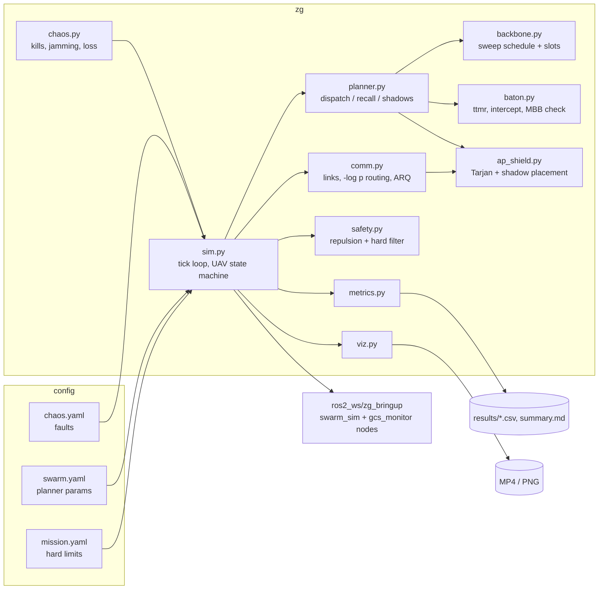
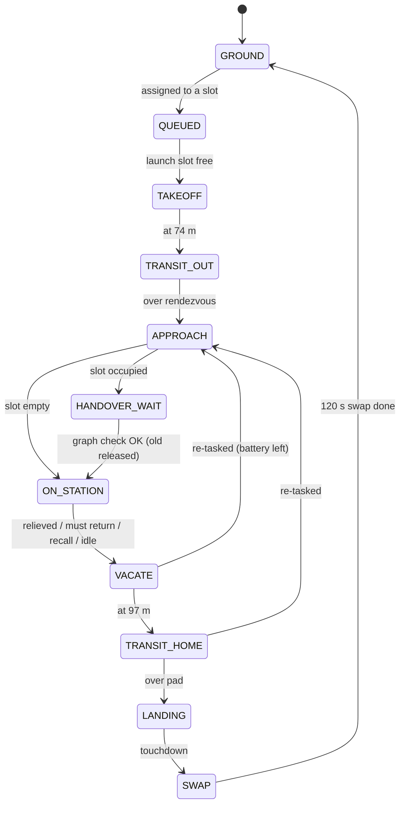

# Architecture

## Module map



## One simulation tick (dt = 0.5 s)

```mermaid
flowchart TD
    A[chaos events] --> B[build comm graph<br/>links <= 100 m, p(d), jamming]
    B --> C[Dijkstra on -log p from GCS<br/>connected set]
    C --> D[Tarjan articulation points<br/>loss per AP]
    D --> E[planner.step]
    E --> E1[failure detection 2 s]
    E --> E2[Baton: make-before-break handovers]
    E --> E3[must-return / 45-min recall / relief dispatch]
    E --> E4[fill + pre-position slots, re-task homing UAVs]
    E --> E5[AP Shield: place shadows]
    E --> E6[launch queue, 1 per 8 s]
    E --> F[POI detection + report packets<br/>store-and-forward, per-hop ARQ]
    F --> G[UAV controllers -> desired velocity]
    G --> H[safety: repulsion, vertical-band gating,<br/>hard separation filter, clamps]
    H --> I[integrate, battery, landing / swap]
    I --> J[metrics sample]
```

## UAV state machine



## Topology ("comb")

```
 GCS --R0--R1--R2-- ... --Rj            relay stations on y = 500, alt 51 m, ~77 m apart
                          |              (only the stations behind the column are occupied)
                          S0             surveyor column, alt 28 m, lanes 71.4 m apart,
                          S1             sweeps x = 35..965 in two 500 m bands
                          ...
                          S6
 shadows (alt 51 m) sit beside the worst articulation points to add a second path
```

Altitude layers: surveyor 28 m, relay/shadow 51 m, outbound transit 74 m, inbound transit 97 m
(23 m apart, so layer separation alone keeps the 20 m minimum).
