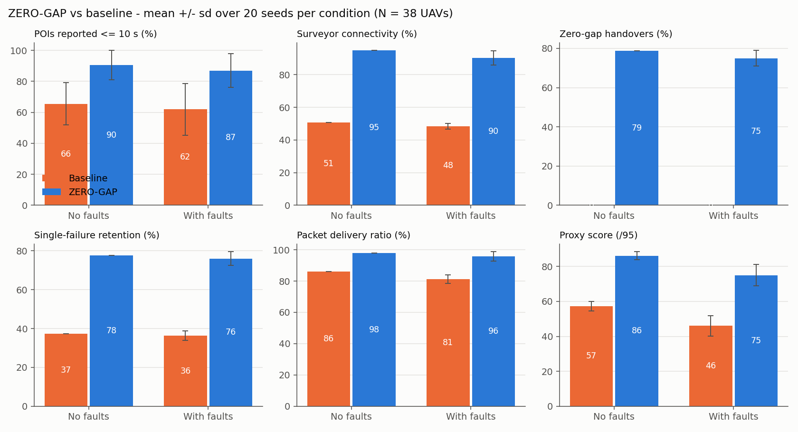
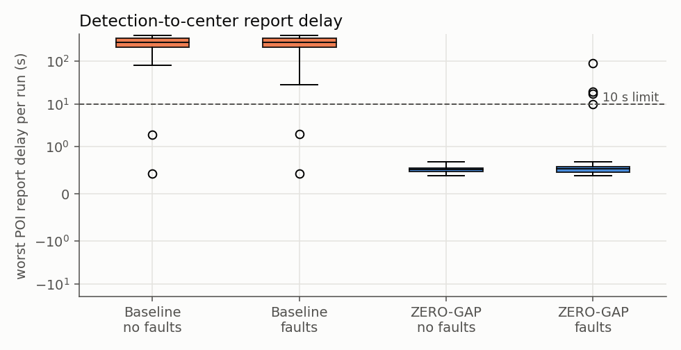
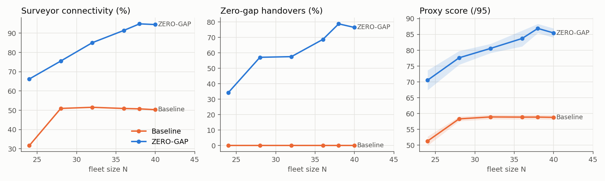
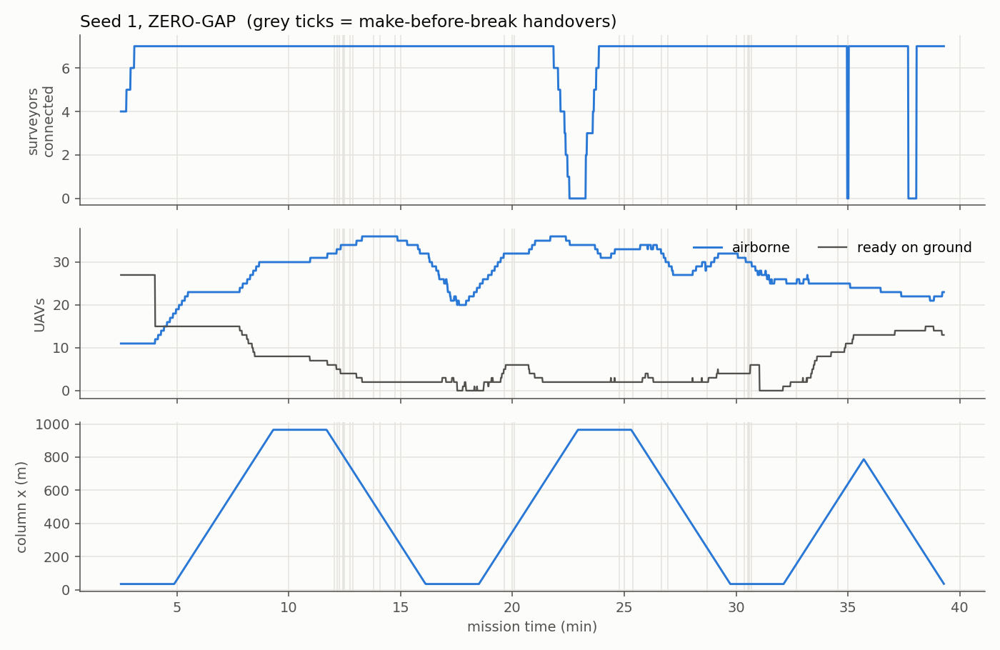

# ZERO-GAP results

All numbers below come from `analysis/run_batch.py`: 20 seeds x {baseline, zerogap} x {no faults, faults}, N = 38 UAVs, 45-min missions. Values are mean +/- sd over seeds. Raw per-run rows: `results/batch_runs.csv`.

| metric | baseline | ZERO-GAP | baseline + faults | ZERO-GAP + faults |
|---|---|---|---|---|
| POIs found (of 10) | 8.8 +/- 1.2 | 9.1 +/- 0.9 | 8.8 +/- 1.1 | 8.8 +/- 0.9 |
| POIs on time <= 10 s (%) | 65.5 +/- 13.6 | 90.5 +/- 9.4 | 62.0 +/- 16.7 | 87.0 +/- 10.8 |
| mean report delay (s) | 40.8 +/- 23.6 | 0.3 +/- 0.1 | 46.3 +/- 28.5 | 1.1 +/- 2.5 |
| max report delay (s) | 258.9 +/- 125.3 | 0.5 +/- 0.1 | 256.3 +/- 129.7 | 7.2 +/- 20.2 |
| mission completion time (s) | 1972.3 +/- 147.3 | 1975.5 +/- 131.4 | 1978.4 +/- 151.1 | 1974.0 +/- 122.2 |
| PDR all packets (%) | 86.0 +/- 0.0 | 97.8 +/- 0.0 | 81.3 +/- 2.7 | 95.8 +/- 3.0 |
| report PDR (%) | 100.0 +/- 0.0 | 100.0 +/- 0.0 | 100.0 +/- 0.0 | 100.0 +/- 0.0 |
| latency mean (ms) | 179.5 +/- 5.0 | 218.3 +/- 0.1 | 175.6 +/- 6.7 | 211.5 +/- 6.6 |
| latency p95 (ms) | 363.9 +/- 0.8 | 497.9 +/- 0.6 | 361.4 +/- 11.3 | 485.1 +/- 12.9 |
| surveyor connectivity availability (%) | 50.7 +/- 0.0 | 94.8 +/- 0.0 | 48.3 +/- 1.7 | 90.4 +/- 4.3 |
| all 7 surveyors connected (% time) | 42.4 +/- 0.0 | 91.7 +/- 0.0 | 39.5 +/- 2.5 | 80.2 +/- 5.6 |
| comm downtime (surveyor-s) | 7613.0 +/- 0.0 | 798.0 +/- 0.0 | 7984.1 +/- 259.6 | 1491.2 +/- 670.0 |
| relay/role handovers | 28.0 +/- 0.0 | 33.0 +/- 0.0 | 26.9 +/- 0.8 | 32.9 +/- 1.1 |
| make-before-break handovers | 0.0 +/- 0.0 | 25.0 +/- 0.0 | 0.0 +/- 0.0 | 24.1 +/- 1.4 |
| zero-gap handovers (%) | 0.0 +/- 0.0 | 78.8 +/- 0.0 | 0.0 +/- 0.0 | 75.0 +/- 3.9 |
| mean handover gap (s) | 194.1 +/- 0.0 | 16.4 +/- 0.0 | 193.2 +/- 16.6 | 23.7 +/- 11.2 |
| failures detected | 0.0 +/- 0.0 | 0.0 +/- 0.0 | 1.3 +/- 0.6 | 1.5 +/- 0.6 |
| recovery time mean (s) | nan +/- nan | nan +/- nan | 116.9 +/- 67.3 | 69.8 +/- 45.3 |
| single-failure tolerance (% time, strict) | 1.6 +/- 0.0 | 0.5 +/- 0.0 | 1.7 +/- 0.7 | 0.2 +/- 0.4 |
| single-failure retention (%) | 37.2 +/- 0.0 | 77.7 +/- 0.0 | 36.3 +/- 2.4 | 76.0 +/- 3.6 |
| shadows deployed | 0.0 +/- 0.0 | 14.0 +/- 0.0 | 0.0 +/- 0.0 | 13.6 +/- 1.4 |
| min inter-UAV distance (m) | 19.8 +/- 0.0 | 20.8 +/- 0.0 | 19.7 +/- 0.8 | 19.1 +/- 2.5 |
| separation violations (<20 m events) | 1.0 +/- 0.0 | 0.0 +/- 0.0 | 0.8 +/- 0.5 | 0.6 +/- 0.9 |
| emergency brake interventions | 14.0 +/- 0.0 | 28.0 +/- 0.0 | 12.2 +/- 5.1 | 31.7 +/- 20.2 |
| min battery (%) | 2.0 +/- 0.0 | 2.0 +/- 0.0 | 2.1 +/- 0.2 | 3.5 +/- 2.2 |
| battery depletions | 0.0 +/- 0.0 | 0.0 +/- 0.0 | 0.0 +/- 0.0 | 0.0 +/- 0.0 |
| geofence violations | 0.0 +/- 0.0 | 0.0 +/- 0.0 | 0.0 +/- 0.0 | 0.0 +/- 0.0 |
| altitude violations | 0.0 +/- 0.0 | 0.0 +/- 0.0 | 0.0 +/- 0.0 | 0.0 +/- 0.0 |
| UAVs lost | 0.0 +/- 0.0 | 0.0 +/- 0.0 | 2.0 +/- 0.0 | 2.0 +/- 0.0 |
| proxy score (/95) | 57.3 +/- 2.8 | 86.2 +/- 2.4 | 46.1 +/- 5.9 | 75.0 +/- 6.1 |
| all UAVs landed by 45:00 (% of runs) | 100% | 100% | 100% | 100% |

The proxy score applies the official weights (mission 25, comm 25, relay/role 20, fault recovery 15, safety 10) to our own metrics; it is **not** the official scorer.

## Fleet size sweep

3 seeds per point, no faults.

| N | baseline connectivity % | ZERO-GAP connectivity % | baseline score | ZERO-GAP score | ZERO-GAP sep. violations |
|---|---|---|---|---|---|
| 24 | 31.7 | 66.2 | 51.3 | 70.5 | 0.0 |
| 28 | 51.0 | 75.6 | 58.3 | 77.6 | 0.0 |
| 32 | 51.6 | 85.1 | 58.9 | 80.6 | 0.0 |
| 36 | 50.9 | 91.4 | 58.9 | 83.7 | 0.0 |
| 38 | 50.7 | 94.8 | 58.9 | 86.9 | 0.0 |
| 40 | 50.3 | 94.5 | 58.8 | 85.5 | 1.0 |

## Fleet sizing (analytical)

* Farthest point from the center: 1185.6 m (far corners).
* Pure relay chain at <= 90 m/hop: 14 hops -> **13 relays** (hop 84.7 m >= 20 m separation: True).
* Surveyor column: lanes 71.4 m apart (< 2 x 40 m footprint), 7 lanes per band -> 7 surveyors.
* Comb backbone: fixed spine stations, only those behind the column are occupied. Peak simultaneous slots 20, mean 13.6.
* Rotation: each slot needs active_frac x cycle / on_station UAVs, where on_station = 1200 - t_out - t_home - 60 margin - 60 handover overlap and cycle = battery used + swap.

| slot | active frac | t_out s | t_home s | on-station s/sortie | UAVs |
|---|---|---|---|---|---|
| R0 | 1.00 | 53 | 82 | 945 | 1.34 |
| R1 | 0.79 | 66 | 97 | 917 | 1.09 |
| R2 | 0.73 | 80 | 114 | 886 | 1.04 |
| R3 | 0.67 | 95 | 132 | 853 | 0.99 |
| R4 | 0.61 | 110 | 150 | 820 | 0.94 |
| R5 | 0.55 | 125 | 169 | 786 | 0.89 |
| R6 | 0.49 | 140 | 187 | 753 | 0.82 |
| R7 | 0.43 | 156 | 205 | 719 | 0.76 |
| R8 | 0.37 | 171 | 224 | 685 | 0.68 |
| R9 | 0.31 | 186 | 242 | 652 | 0.60 |
| R10 | 0.25 | 202 | 261 | 618 | 0.51 |
| R11 | 0.20 | 217 | 279 | 584 | 0.44 |
| R12 | 0.16 | 233 | 297 | 550 | 0.37 |
| S0 | 1.00 | 154 | 203 | 723 | 1.75 |
| S1 | 1.00 | 149 | 197 | 734 | 1.73 |
| S2 | 1.00 | 146 | 194 | 740 | 1.71 |
| S3 | 1.00 | 145 | 193 | 742 | 1.71 |
| S4 | 1.00 | 147 | 195 | 739 | 1.72 |
| S5 | 1.00 | 150 | 199 | 731 | 1.73 |
| S6 | 1.00 | 155 | 205 | 720 | 1.76 |

* Rotation fleet (sum): **22.6**
* + AP-Shield shadows: 3, + fault reserve: 2
* **Recommended N = 28**

The steady-state model ignores the 45-min horizon (everyone starts charged, the last sorties are short), so the simulated sweep over N in results/ is the final word.

## Single run timeline (seed 1, ZERO-GAP, no faults)

